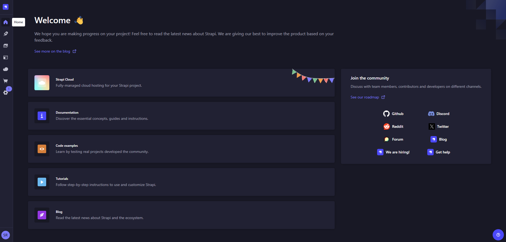
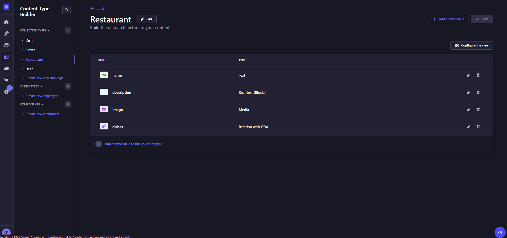
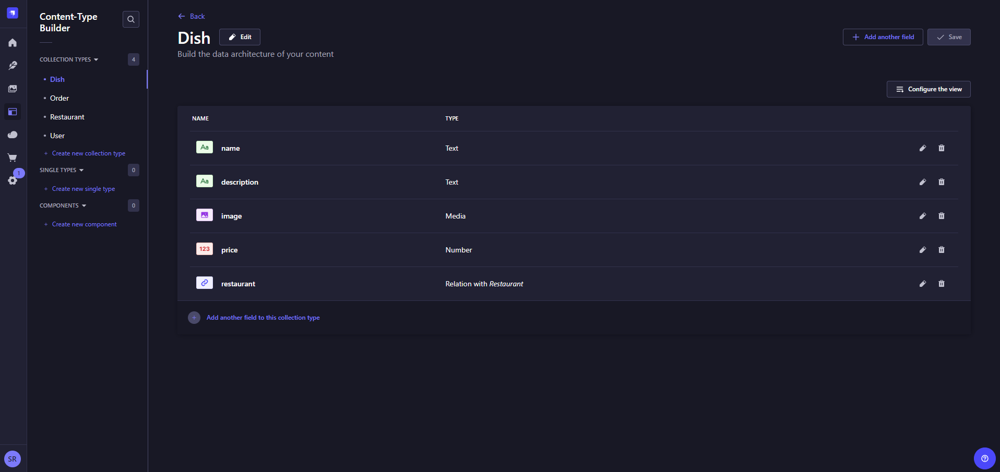

# Online Restaurant APP Backend - Strapi

### Version
0.1.0

### License
Copyright &copy; 2024 Shehan Rathnayake. All Rights Reserved. 
This project is licensed under [MIT License](License.txt).

## Introduction
this project is the backend part of online restaurant app developed using Strapi CMS.

## Key Features
- Authentication and role based Authorization
- Intergrating with Stripe payment gateway

## Tech Stack Used
- Strapi CMS platform
- Stripe Payment Gateway

## Supported Links
- [Frontend part GitHub Repository](https://github.com/shehanrathnayake/online-restaurant-app-frontend-nextjs)

## Sample Images
 

 

 

### Support

***If you like what I do, maybe consider buying me a coffee*** 🥺 👇

  